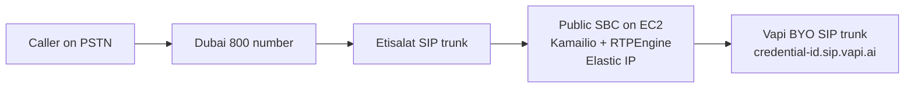
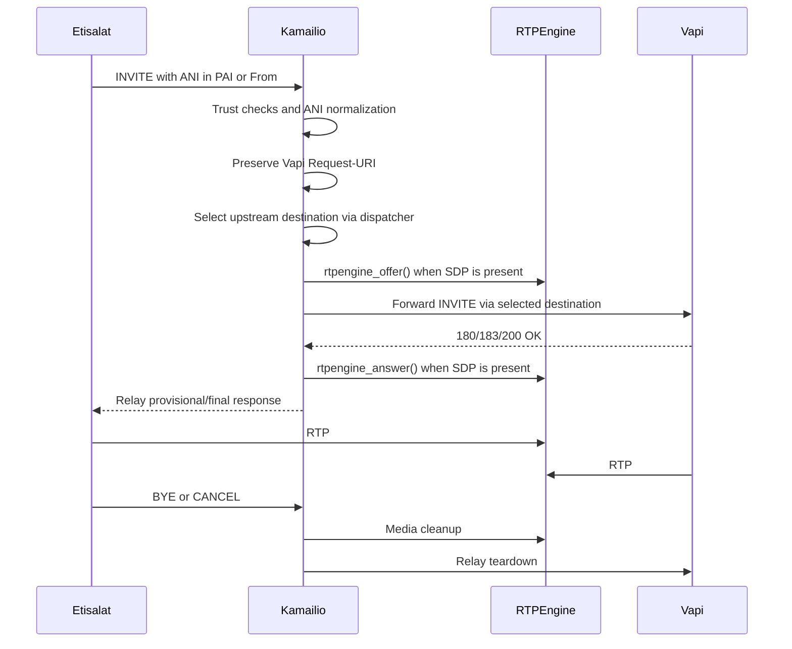

# Etisalat to Vapi SBC Solution Design

## Document Status

This document defines the Etisalat -> Kamailio/RTPEngine -> Vapi SBC architecture, production configuration approach, operational requirements, and lab validation baseline.

Current local source of truth:

- [lab/kamailio/kamailio-lab.cfg](../lab/kamailio/kamailio-lab.cfg)
- [lab/kamailio/dispatcher.list](../lab/kamailio/dispatcher.list)
- [docs/wsl2-lab-build-record.md](wsl2-lab-build-record.md)
- [docs/implementation-evidence-log.md](implementation-evidence-log.md)

## Executive Summary

The recommended production architecture is a public-facing SBC layer in AWS, using Kamailio for SIP signaling and RTPEngine for SDP/RTP media anchoring. The active SBC should use a stable Elastic IP so Etisalat has one carrier-facing destination address, with a warm standby available for active-passive failover if required.

The local WSL2 lab validated the core SIP behavior: ANI extraction from `P-Asserted-Identity` with fallback to `From`, custom ANI header injection, optional `From` rewrite, source-IP trust enforcement, Pike rate limiting, dispatcher-based upstream failover, RTPEngine SDP rewrite, and RTPEngine cleanup on teardown/failover paths.

The lab does not prove live Etisalat behavior, live Vapi credential acceptance, AWS public/private address handling, TLS, or final production timer behavior. Those remain deployment-readiness items.

## Goals

- Receive inbound SIP calls from Etisalat through a controlled public SBC.
- Preserve or normalize caller ANI when it may appear in `P-Asserted-Identity` or `From`.
- Forward caller identity to Vapi in a predictable form.
- Preserve the Vapi credential-style Request-URI while using dispatcher for actual upstream destination selection.
- Anchor SDP and RTP through RTPEngine instead of relying on direct carrier-to-Vapi media.
- Enforce source trust at the SIP edge.
- Keep the first production availability model pragmatic and honest about mid-call failover limitations.

## Non-Goals

- Proving real Etisalat trunk behavior in the local lab.
- Proving live Vapi credential acceptance in the local lab.
- Freezing provider IPs, ports, regional AWS capacity, or instance availability forever.
- Replacing the lab evidence log or packet captures.
- Designing a full PBX, IVR, call-center, recording, conferencing, or B2BUA feature set.

## Architecture

### Logical Topology



### Call Flow



### Component Responsibilities

| Component | Responsibility |
|---|---|
| Etisalat SIP trunk | Delivers carrier signaling and media to the SBC edge. |
| Kamailio | Enforces the SIP trust boundary, normalizes ANI, injects custom headers, preserves the Vapi Request-URI, selects upstream destinations, and handles SIP transactions. |
| RTPEngine | Rewrites SDP and relays RTP so media is anchored through the SBC. |
| Vapi BYO SIP trunk | Receives the forwarded call using the expected credential-oriented SIP URI and caller identity. |
| AWS network layer | Provides public subnet routing, Elastic IP, security groups, and active-passive failover mechanics. |

## Key Design Decisions

### Public EC2 SBC With Elastic IP

The SBC must receive unsolicited inbound SIP from the carrier. That makes a public subnet with an Internet Gateway path the right first production shape. NAT-only private subnets are not suitable for the active SIP ingress point.

Use an Elastic IP on the active instance or, preferably, on the active primary ENI. This gives Etisalat a stable destination and supports later active-passive failover by remapping the EIP to a warm standby.

### Kamailio Plus RTPEngine

Kamailio is a focused SIP proxy and routing engine. It is a better fit than a full PBX when the requirement is SIP edge policy, ANI normalization, upstream destination selection, and failover.

RTPEngine is required when media should be controlled by the SBC. Without RTPEngine, Kamailio can proxy signaling while RTP may still try to flow directly between Etisalat and Vapi.

### ANI Policy

The design assumes Etisalat may place caller identity in different headers.

Production policy:

- Prefer `P-Asserted-Identity` when present and trusted.
- Fall back to the SIP `From` user when PAI is absent.
- Forward the normalized ANI to Vapi using the canonical custom header once Vapi confirms the expected name.
- Rewrite `From` only when the inbound `From` value does not already carry the intended ANI.

The lab currently sends both `X-Original-Caller` and `X-Original_Caller` as a discovery measure. Production should keep one canonical form after Vapi confirmation.

### Vapi Request-URI And Dispatcher

The Vapi Request-URI should remain in credential form:

```text
sip:<did>@<credential-id>.sip.vapi.ai
```

Kamailio should select the actual Vapi signaling destination separately through dispatcher by setting `$du`. This keeps the logical Vapi credential identity in the Request-URI while allowing failover and destination selection at the proxy layer.

### Media Anchoring

RTPEngine rewrites SDP so both Etisalat and Vapi send RTP to the SBC instead of directly to each other.

This provides:

- controlled media path
- NAT/public-address correction
- simpler firewall reasoning
- packet-level troubleshooting at one point
- clean media cleanup on BYE, CANCEL, failover, or failed call setup

### Availability Model

The first production model should be active-passive:

- one active SBC
- one warm standby in another availability zone
- Elastic IP remapped during failover

New calls can recover after failover. In-progress calls on the failed node should be treated as non-preserved unless a more complex shared-state/media design is introduced later.

## Lab Validation Baseline

### Lab Environment

| Item | Lab Value |
|---|---|
| Runtime | WSL2 Ubuntu 24.04.4 LTS |
| Kamailio | Ubuntu package, observed as 5.7.4 in evidence |
| RTPEngine | `rtpengine-daemon`, userspace daemon path |
| SIPp | `sip-tester` package exposing `sipp` |
| SBC lab IP | `10.10.10.10` |
| Fake Etisalat IP | `10.10.10.20` |
| Fake Vapi A | `10.10.10.41:5070` |
| Fake Vapi B | `10.10.10.42:5080` |
| Untrusted source | `10.10.10.99` |
| Lab SIP transport | UDP only |
| Lab Kamailio listen | `udp:10.10.10.10:5060` |
| Lab RTPEngine range | `40000-40100` in SDP/CANCEL runners |

### Lab-Proven Behavior

| Behavior | Result |
|---|---|
| ANI from `P-Asserted-Identity` | Proven with SIPp/tshark evidence. |
| ANI fallback from `From` | Proven with SIPp/tshark evidence. |
| Custom ANI headers | Both `X-Original-Caller` and `X-Original_Caller` injected in lab. |
| Optional `From` rewrite | Proven when PAI user differs from From user. |
| Trust-boundary rejection | Untrusted source receives `403 Forbidden`. |
| Pike rate limiting | Flood test produces `503 Rate Limit Exceeded`. |
| Dispatcher failover | Failed Vapi A path retries Vapi B and succeeds. |
| SDP anchoring | SDP `c=` and media ports rewritten through RTPEngine. |
| BYE/CANCEL cleanup path | RTPEngine cleanup visible in logs. |
| CANCEL transaction handling | Caller receives `200 canceling` for CANCEL, upstream receives CANCEL, upstream returns `200 OK` to CANCEL and `487 Request Terminated`, and caller receives final `487 Request Terminated`. |

### Lab Boundaries

The lab did not prove:

- real Etisalat source IP ranges
- real Etisalat transport choice
- real Etisalat ANI placement
- live Vapi credential acceptance
- AWS public/private address advertisement
- TLS signaling
- production dispatcher health probing
- production timer values

### CANCEL Validation Detail

The isolated CANCEL test now shows the expected transaction flow:

```text
caller CANCEL
upstream CANCEL
caller leg: 200 canceling for CANCEL
upstream:   200 OK for CANCEL, then 487 Request Terminated
caller leg: 487 Request Terminated for INVITE
```

The lab SIPp scenario uses the same Via branch for the INVITE, CANCEL, and non-2xx ACK so Kamailio can match the CANCEL to the original INVITE transaction. Kamailio deletes RTPEngine state only after `t_check_trans()` confirms the transaction exists.

## Production Deployment Inputs

The following values are placeholders until confirmed during onboarding:

| Input | Placeholder / Current Planning Value | Required Action |
|---|---|---|
| AWS region | `me-central-1` | Reconfirm capacity and instance availability before deployment. |
| SBC private IP | `PRIVATE_IP` | Set from EC2 primary interface. |
| SBC public IP | `PUBLIC_IP` / Elastic IP | Allocate and attach to active ENI. |
| Etisalat signaling IPs | `ETISALAT_SIG_IPS` | Obtain from Etisalat. |
| Etisalat media IP/range | unknown | Obtain or validate from packet flow. |
| Etisalat transport | UDP/TCP/TLS unknown | Confirm with Etisalat. |
| Vapi signaling IPs | `44.229.228.186`, `44.238.177.138` | Revalidate with current Vapi networking docs before go-live. |
| Vapi signaling transport | UDP `5060`, TLS `5061` planning values | Do not assume TCP `5060` unless Vapi confirms it. |
| RTP port range on SBC | recommended `40000-60000` | Confirm with security group and RTPEngine config. |
| Vapi custom ANI header | not finalized | Confirm canonical header name with Vapi. |

## Installation Guidance

### Package-First Install Path

The lab-proven Ubuntu 24.04 path is package-first.

```bash
sudo apt update
sudo apt install -y \
  kamailio \
  kamailio-extra-modules \
  kamailio-utils-modules \
  kamcli \
  rtpengine-daemon \
  sip-tester \
  sngrep \
  tcpdump \
  tshark \
  net-tools \
  iproute2 \
  ngrep \
  curl \
  jq \
  ca-certificates \
  awscli
```

Notes:

- `sip-tester` is the Ubuntu package that exposes SIPp.
- `rtpengine-daemon` is the correct userspace-first RTPEngine package path.
- Avoid installing the broad `rtpengine` metapackage first in WSL2 because it can pull in DKMS/kernel-mode components that are not needed for this lab or first production cut.
- A source build remains a fallback if production package versions or modules are unsuitable.

## Configuration Design

This section documents production configuration guidance. The running lab config remains the source of truth for validated behavior; the production snippets below are templates and must be syntax-checked against the deployed Kamailio version.

### Kamailio Module Set

The lab uses these core modules:

```cfg
loadmodule "sl.so"
loadmodule "tm.so"
loadmodule "rr.so"
loadmodule "maxfwd.so"
loadmodule "sanity.so"
loadmodule "textops.so"
loadmodule "siputils.so"
loadmodule "pv.so"
loadmodule "xlog.so"
loadmodule "dispatcher.so"
loadmodule "dialog.so"
loadmodule "uac.so"
loadmodule "rtpengine.so"
loadmodule "pike.so"
loadmodule "ctl.so"
```

`kamcmd` requires RPC access. The lab uses `ctl.so`:

```cfg
modparam("ctl", "binrpc", "unix:/tmp/kamailio_ctl")
```

For production, place the socket under a controlled runtime path and adjust permissions accordingly.

### Production Listener Placeholders

The lab listens only on UDP `5060`. Production should use explicit public/private advertise settings.

```cfg
listen=udp:PRIVATE_IP:5060 advertise PUBLIC_IP:5060

# Add only if required and tested:
# listen=tcp:PRIVATE_IP:5060 advertise PUBLIC_IP:5060
# listen=tls:PRIVATE_IP:5061 advertise PUBLIC_IP:5061
```

TLS requires a separate TLS module/configuration and certificate handling plan. Do not enable it only by adding a listener.

### Transaction Timers

Do not reuse lab timer values directly. The lab used intentionally aggressive values for fast simulation.

Current Kamailio TM documentation defines these timer values in milliseconds. Production should define and test timer values explicitly. Example placeholders:

```cfg
modparam("tm", "fr_timer", 10000)
modparam("tm", "fr_inv_timer", 120000)
```

The lab values are much shorter than production values and should be treated as test accelerators only.

### Dispatcher

Dispatcher failover depends on storing the remaining selected destinations in XAVP, then using `ds_next_dst()` in `failure_route`. The lab does this with dispatcher `flags=2`.

Production dispatcher module template:

```cfg
modparam("dispatcher", "list_file", "/etc/kamailio/dispatcher.list")
modparam("dispatcher", "flags", 2)
modparam("dispatcher", "xavp_dst", "_dsdst_")
modparam("dispatcher", "force_dst", 1)

# Keep 0 until Vapi OPTIONS probing behavior is confirmed.
modparam("dispatcher", "ds_ping_interval", 0)
```

For maximum portability, use the two-argument form unless the deployed Kamailio version is confirmed to support and need the optional limit argument. Kamailio 5.7 documents the optional limit argument, and the lab currently uses it, but it is not required for a two-destination Vapi list.

```cfg
# Algorithm 0 = hash over Call-ID.
if (!ds_select_dst("1", "0")) {
    sl_send_reply("503", "No Vapi destination available");
    exit;
}
```

Production dispatcher list template:

```cfg
# /etc/kamailio/dispatcher.list
# UDP 5060 is the current Vapi planning transport. TCP 5060 is not assumed.
# Revalidate Vapi signaling IPs and transport before deployment.
# setid destination                              flags priority attrs
1 sip:44.229.228.186:5060;transport=udp         0     10       duid=vapi-a
1 sip:44.238.177.138:5060;transport=udp         0     10       duid=vapi-b
```

The lab dispatcher list is:

```cfg
1 sip:10.10.10.41:5070;transport=udp            0     10       duid=vapi-a
1 sip:10.10.10.42:5080;transport=udp            0     10       duid=vapi-b
```

Candidate failover route:

```cfg
t_on_failure("VAPI_FAILOVER");

failure_route[VAPI_FAILOVER] {
    if (t_is_canceled()) {
        exit;
    }

    if (t_check_status("408|5[0-9][0-9]")) {
        rtpengine_delete();

        if (ds_next_dst()) {
            rtpengine_offer("trust-address replace-origin replace-session-connection");
            t_on_failure("VAPI_FAILOVER");
            t_relay();
            exit;
        }

        t_reply("503", "No Vapi destination available");
        exit;
    }
}
```

The failover retry assumes the inbound INVITE contains SDP, which is true for the validated lab scenarios and should be confirmed with Etisalat. If delayed-offer calls must be supported, handle that as a separate media path instead of copying this candidate route unchanged.

### INVITE And Dialog Handling

If `uac` restore mode depends on dialog state, manage dialogs early in the trusted INVITE path.

```cfg
if (is_method("INVITE")) {
    dlg_manage();
    record_route();
    route(TO_VAPI);
    exit;
}
```

This is cleaner than conditionally calling `dlg_manage()` only when `From` is rewritten.

### ANI Extraction

Prefer checking for header presence over fragile null-style checks.

```cfg
$var(ani) = "";

if (is_present_hf("P-Asserted-Identity") && $ai != "") {
    $var(ani) = $(ai{uri.user});
}

if ($var(ani) == "") {
    $var(ani) = $fU;
}

if ($var(ani) == "") {
    $var(ani) = "unknown";
}
```

Temporary custom header discovery:

```cfg
# TODO: Remove one of these after Vapi confirms the canonical header name.
append_hf("X-Original-Caller: $var(ani)\r\n");
append_hf("X-Original_Caller: $var(ani)\r\n");
```

Optional `From` rewrite:

```cfg
if (is_present_hf("P-Asserted-Identity") && $(ai{uri.user}) != "" && $(ai{uri.user}) != $fU) {
    $var(new_from_uri) = "sip:" + $var(ani) + "@" + $fd;
    uac_replace_from("", $var(new_from_uri));
}
```

### CANCEL Handling

Avoid unconditional media cleanup before confirming transaction context.

```cfg
if (is_method("CANCEL")) {
    if (t_check_trans()) {
        rtpengine_delete();
        t_relay();
    }
    exit;
}
```

This pattern is validated by the current CANCEL test.

### RTPEngine

Lab Kamailio talks to RTPEngine on:

```cfg
modparam("rtpengine", "rtpengine_sock", "udp:127.0.0.1:2223")
```

Production RTPEngine template:

```ini
[rtpengine]
table = -1
interface = public/PRIVATE_IP!PUBLIC_IP
listen-ng = 127.0.0.1:2223
listen-cli = 127.0.0.1:9901
port-min = 40000
port-max = 60000
tos = 184
pidfile = /run/rtpengine/rtpengine.pid
log-facility = local1
```

Confirm the exact package service name in the target OS. Ubuntu package installation may provide `rtpengine-daemon.service`; do not assume a custom unit is required unless building manually.

Use one RTPEngine flag string consistently in the initial INVITE path, failover retry path, and answer path. The lab-proven candidate is:

```cfg
rtpengine_offer("trust-address replace-origin replace-session-connection");
rtpengine_answer("trust-address replace-origin replace-session-connection");
```

Add or remove flags such as `ICE=remove` only after live SDP behavior is confirmed, and then apply the same decision consistently to both initial and failover offer handling.

## AWS Network And Security Model

### Security Group Rules

AWS security groups are stateful. Ordinary replies to outbound flows do not need separate inbound rules, but carrier-originated and provider-originated traffic still must be allowed where applicable.

First-cut rule model:

| Direction | Protocol | Port | Source / Destination | Purpose |
|---|---:|---:|---|---|
| Inbound | UDP | `5060` | Etisalat signaling IPs | Carrier SIP if UDP is used. |
| Inbound | TCP | `5060` | Etisalat signaling IPs | Only if Etisalat requires TCP. |
| Inbound | TCP | `5061` | Etisalat signaling IPs | Only if Etisalat requires TLS. |
| Inbound | UDP | `40000-60000` | Etisalat/Vapi media sources as far as safely knowable | RTP to RTPEngine. |
| Outbound | UDP | `5060` | Vapi signaling IPs | SIP to Vapi when UDP is used. |
| Outbound | TCP | `5061` | Vapi signaling IPs | TLS SIP to Vapi if enabled. |
| Outbound | UDP | broad enough for RTP | Etisalat and Vapi media endpoints | RTPEngine media egress. |
| Outbound | TCP | `443` | AWS services/package repos/monitoring | SSM, updates, telemetry. |

Do not over-tighten outbound RTP to Vapi `40000-60000` only. That range is Vapi's local media range, not necessarily the remote port the SBC will send to on every leg.

Avoid opening SIP to `0.0.0.0/0` except for temporary controlled testing. RTP may need broader treatment until provider media behavior is confirmed.

### Elastic IP Association Script

Use IMDSv2.

```bash
#!/usr/bin/env bash
set -euo pipefail

REGION="me-central-1"
ALLOCATION_ID="eipalloc-xxxxxxxxxxxxxxxxx"

TOKEN="$(curl -fs -X PUT 'http://169.254.169.254/latest/api/token' \
  -H 'X-aws-ec2-metadata-token-ttl-seconds: 21600')"

INSTANCE_ID="$(curl -fs \
  -H "X-aws-ec2-metadata-token: ${TOKEN}" \
  http://169.254.169.254/latest/meta-data/instance-id)"

aws ec2 associate-address \
  --region "$REGION" \
  --allocation-id "$ALLOCATION_ID" \
  --instance-id "$INSTANCE_ID" \
  --allow-reassociation
```

For production failover, prefer remapping the EIP to the active ENI if that is how the standby design is implemented.

## Operations And Validation

### Syntax And Service Checks

```bash
kamailio -c -f /etc/kamailio/kamailio.cfg

systemctl list-units --type=service --all | grep -E 'kamailio|rtpengine'

systemctl status kamailio --no-pager
systemctl status rtpengine-daemon --no-pager

ss -lntup | grep -E '(:5060|:2223|:9901)'
journalctl -u kamailio -u rtpengine-daemon -n 100 --no-pager
```

Replace `rtpengine-daemon` with the unit name discovered on the target host if the package exposes a different service name.

### Runtime Inspection

```bash
kamcmd -s unix:/tmp/kamailio_ctl dispatcher.list
kamcmd -s unix:/tmp/kamailio_ctl pike.top
sngrep -d any port 5060
tcpdump -ni any udp portrange 40000-60000
```

If `kamcmd` cannot connect, verify the `ctl.so` module and make the `-s` socket path match the configured `modparam("ctl", "binrpc", ...)` value.

### Live Call Validation

Before production acceptance:

1. Confirm Vapi accepts the Kamailio Elastic IP as the expected SIP gateway/source.
2. Place a real inbound call to the Etisalat number from a known caller number.
3. Verify the inbound INVITE carries ANI in `P-Asserted-Identity`, `From`, or another confirmed carrier header.
4. Verify Kamailio extracts the intended ANI.
5. Verify the forwarded INVITE preserves the Vapi credential Request-URI.
6. Verify only the approved custom ANI header is kept for production.
7. Verify Vapi sees the expected caller identity and assistant variables.
8. Verify SDP is rewritten to the SBC media address.
9. Verify RTP flows through RTPEngine.
10. Test BYE and CANCEL teardown.
11. Confirm caller-leg final response behavior for CANCEL is correct.
12. Stop one Vapi destination and verify dispatcher failover for new calls.

## Production Readiness Items

These items must be closed before release:

| Item | Status |
|---|---|
| Etisalat signaling IP allowlist | Open. |
| Etisalat transport | Open. UDP/TCP/TLS must be confirmed. |
| Etisalat ANI placement | Open. Must be observed on live traffic. |
| Vapi canonical custom ANI header | Open. Lab currently sends two variants. |
| Vapi credential acceptance | Open. Must be tested with live tenant. |
| Public/private AWS address handling | Open. Not modeled in WSL2 lab. |
| Dispatcher health checks | Candidate only. Lab disables probing. |
| Production SIP timers | Open. Lab timers are not production values. |
| TLS | Open. Not configured in lab. |
| Instance type/capacity | Open. Recheck AWS region availability and quota at deployment. |

## Relationship To Other Documents

- This file is the canonical solution design.
- [wsl2-lab-build-record.md](wsl2-lab-build-record.md) explains the lab environment, topology, rebuild flow, and test suite.
- [implementation-evidence-log.md](implementation-evidence-log.md) records the lab execution and packet-level evidence.

## External References To Revalidate

Recheck these sources during deployment:

- Vapi SIP networking requirements: `https://docs.vapi.ai/advanced/sip/sip-networking`
- Kamailio TM module timers and transaction behavior: `https://kamailio.org/docs/modules/stable/modules/tm.html`
- Kamailio dispatcher module failover behavior: `https://kamailio.org/docs/modules/5.7.x/modules/dispatcher.html`
- AWS EC2 instance types by region: `https://docs.aws.amazon.com/ec2/latest/instancetypes/ec2-instance-regions.html`
- AWS IMDSv2 guidance: `https://docs.aws.amazon.com/AWSEC2/latest/UserGuide/configuring-instance-metadata-service.html`
- AWS security group rules: `https://docs.aws.amazon.com/vpc/latest/userguide/security-group-rules.html`
