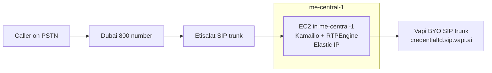
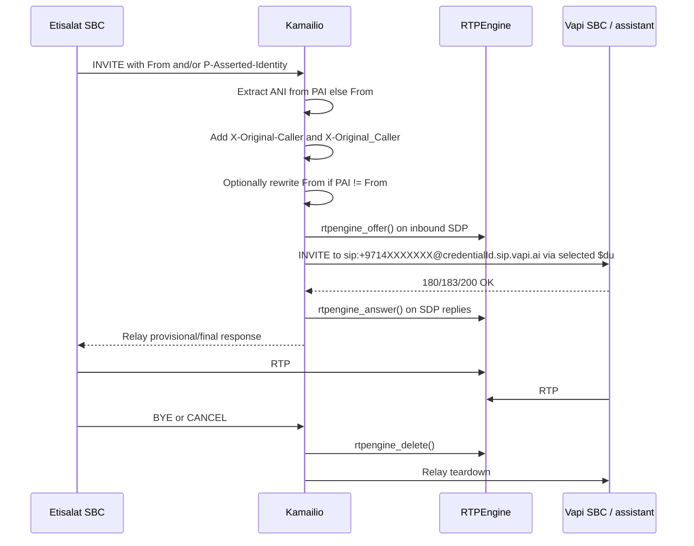
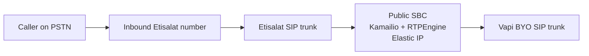
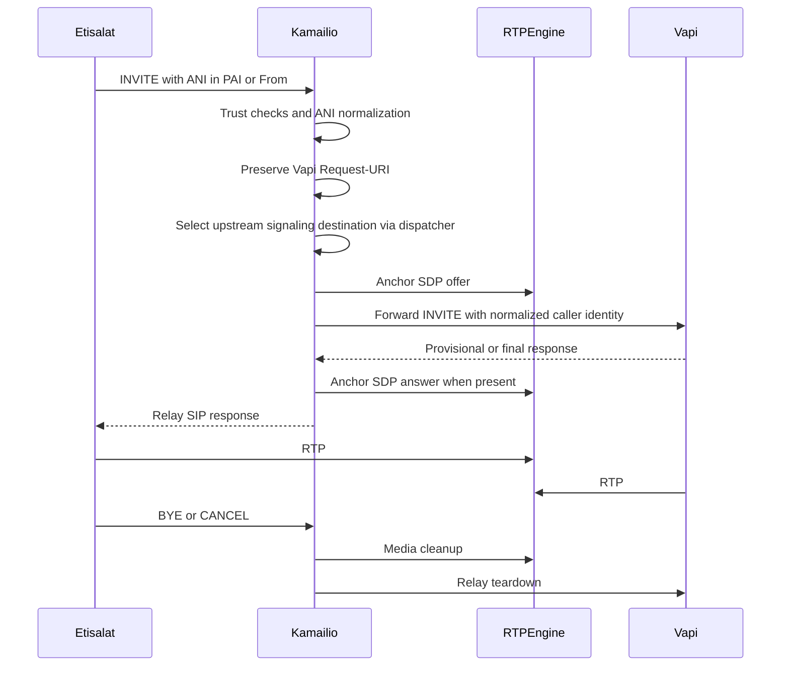

# Etisalat to Vapi SBC Solution Design

## Post-lab revision note

This report has been revised after the local WSL2 Kamailio/RTPEngine/SIPp lab was implemented and revalidated with `tshark` evidence. The original research recommendations remain directionally correct, but several claims must now be read with the validated lab boundaries below:

- The lab validated the core SBC logic locally: ANI extraction from `P-Asserted-Identity` and fallback to `From`, dual custom ANI header injection, optional `From` rewrite, source-IP trust rejection, Pike rate limiting, dispatcher failover, SDP/media anchoring through RTPEngine, and RTPEngine cleanup on teardown paths.
- The lab did **not** validate real Etisalat transport, real Etisalat source IP ranges, real Etisalat ANI placement, real Vapi credential acceptance, AWS Elastic IP behavior, public/private AWS media addressing, or TLS.
- The lab intentionally used UDP-only signaling on `5060`, loopback/lab IPs, aggressive SIP timers, disabled dispatcher health checks, and a single-interface RTPEngine setup.
- The CANCEL test proved upstream `CANCEL` propagation and RTPEngine cleanup, but the caller leg currently receives `408 Request Timeout` rather than a relayed `487 Request Terminated`. That must be corrected and revalidated before production.
- The embedded production configuration in this report should be treated as a production **candidate**, not as code already executed end-to-end against Etisalat and Vapi.
- The AWS `me-central-1` instance-family note and Vapi SIP/RTP networking assumptions were rechecked against official docs on April 24, 2026, but they should still be verified again during deployment because provider guidance and regional capacity can change.

## Executive summary

The best production design for this case remains a public-subnet EC2 SBC in `me-central-1` running Kamailio for SIP signaling and RTPEngine for media anchoring, with an Elastic IP attached to the active instance or, preferably, to the active primary ENI. The local lab validated the core behavior behind that recommendation: Kamailio can normalize ANI from `P-Asserted-Identity` or `From`, inject the custom ANI headers, preserve the Vapi credential-style Request-URI while dispatching to an upstream destination, reject untrusted sources, fail over between upstream targets, and use RTPEngine for SDP/media anchoring. This does **not** mean the exact production provider values are final; Etisalat IPs, Etisalat transport, Vapi credential acceptance, AWS public/private address handling, TLS, and the caller-leg CANCEL final response still require live validation. As of an April 24, 2026 check, AWS’s EC2-by-Region documentation for `me-central-1` does **not** list the T-family, so `t3.micro` should be treated as unavailable unless rechecked at deployment time; first-pass alternatives remain `m6g.medium`/`m7g.medium` on Graviton and `m6i.large`/`m7i.large` on x86. Vapi’s official networking page still documents UDP `5060`, TLS `5061`, signaling IPs `44.229.228.186` and `44.238.177.138`, dynamic RTP media IPs, and UDP `40000-60000` for RTP media; revalidate those directly with Vapi before go-live. citeturn27search8turn25view0turn25view1turn25view3turn26view1turn6view0

The simplest thing to test **before** building anything is direct Etisalat → Vapi, because Vapi’s API reference says that for inbound SIP calls the customer number is extracted from the `From` header. If Etisalat already sends the original ANI exactly the way you need in `From`, that direct path may work for a proof of concept. But it does **not** solve the full requirement set well: if ANI is only present in `P-Asserted-Identity`, if you need a custom `X-Original-Caller` header, if you want controlled failover between Vapi SBC IPs, or if you want deterministic cloud-edge media behavior instead of trusting direct carrier↔Vapi RTP, then you need an intermediary SBC. Vapi’s own custom SIP header documentation shows that custom headers can be exposed to the assistant as variables, while its Amazon Chime Voice Connector integration guide explicitly says the Voice Connector-only path does **not** support custom SIP headers or enriched metadata. That makes a managed Chime Voice Connector attractive only for the “very simple, no custom context” case, not for your stated requirement. citeturn7search0turn4view0turn4view4

Relative to alternatives, Kamailio + RTPEngine is still the best fit because Kamailio is a SIP proxy/dispatcher rather than a heavyweight PBX, and Kamailio does not relay media by itself. RTPEngine provides the media relay/SDP rewrite function that the lab successfully exercised. Asterisk remains feasible and can add custom headers with `PJSIP_HEADER()`, but it is a full B2BUA/PBX approach and is heavier than necessary unless PBX features are required. The practical recommendation is therefore: **test direct routing first as a no-build sanity check; use Kamailio + RTPEngine as the production SBC architecture if direct routing does not meet the requirements; skip Chime Voice Connector unless custom SIP headers are no longer required; use Asterisk only if PBX/B2BUA features become part of the scope.** citeturn31search0turn21view2turn14view1turn14view2turn14view3turn30search0

## Requirements and constraints

Your target Region, `me-central-1`, is the Middle East UAE Region and AWS documents it with three Availability Zones: `mec1-az1`, `mec1-az2`, and `mec1-az3`. As of an April 24, 2026 check, AWS EC2 Region availability documentation for `me-central-1` lists general-purpose families `M5`, `M5d`, `M6g`, `M6gd`, `M6i`, `M7g`, `M7gd`, `M7i`, and `M8g`, but not `T3` or `T4g`. The general-purpose instance specification page showed the smallest documented sizes in those available families as `m6g.medium`/`m7g.medium` with 1 vCPU and 4 GiB RAM, and `m6i.large`/`m7i.large` with 2 vCPUs and 8 GiB RAM. Treat that as a deployment-time check, not a permanently frozen AWS fact. citeturn27search1turn27search8turn25view0turn25view1turn25view3turn26view1

For Vapi networking, the current official requirements are clear on the signaling side and deliberately broad on the media side. Vapi publishes two static SIP signaling IPs, `44.229.228.186/32` and `44.238.177.138/32`, documents UDP `5060` as the default SIP port, TLS `5061` for encrypted signaling, and states that both signaling IPs must be allowlisted because either may be used for any given call. For RTP, Vapi explicitly says there are **no static media IPs**, that media source IPs are dynamic, and that the `40000-60000` UDP range applies to Vapi’s local RTP ports rather than the remote provider’s advertised RTP ports. That last point is very important for firewall design: you cannot safely over-tighten RTP around a small fixed IP list on the Vapi side. citeturn6view0

On the Vapi application side, two behaviors matter most here. First, Vapi’s API documentation says that for inbound SIP calls the customer number is extracted from the `From` header. Second, Vapi’s SIP custom header documentation shows that custom SIP headers can be passed into the assistant as variables. The lab validated the proxy-side version of that policy: prefer `P-Asserted-Identity` for ANI extraction when present, fall back to `From`, add both `X-Original-Caller` and `X-Original_Caller` during discovery, and rewrite `From` only when the PAI user differs from the inbound `From` user. Production should standardize on one canonical custom ANI header after Vapi confirms which form is expected. citeturn7search0turn4view0turn10view4turn10view6turn10view5

Several material unknowns remain and should be treated as engineering risks, not assumptions: Etisalat’s exact signaling IP list is not yet specified; Etisalat’s transport is not yet verified as UDP, TCP, or TLS; Etisalat’s ANI placement is not yet verified as `P-Asserted-Identity`, `From`, or another header; and the Vapi credential acceptance behavior has not been tested with the live tenant. The lab was UDP-only, so any production TCP/TLS listener must be added deliberately and tested. Vapi’s original public networking research documented UDP `5060` and TLS `5061`, but did **not** document generic TCP `5060` for its SBCs, so outbound TCP `5060` to Vapi should be treated as unverified until Vapi says otherwise. Those unknowns do not block the design, but they do affect the final security group and listener choices. citeturn6view0

## Alternatives and why the recommended design wins

The direct Etisalat → Vapi path is operationally the simplest option and should absolutely be tested first, because if Etisalat already sends caller ANI in `From`, Vapi can extract it natively and you might avoid building anything at all for a proof of concept. The problem is that this only works if the carrier’s existing signaling already matches Vapi’s expectations and if you do not need the custom header requirement. There is also no place in that design to inject `X-Original-Caller`, normalize ANI from `P-Asserted-Identity`, or hide transport/media quirks between carrier and cloud edge. It is the best **first test**, but not the best **final architecture** for your stated requirement. citeturn7search0turn4view0

A Kamailio-only proxy without RTPEngine is viable only if direct media between Etisalat and Vapi works reliably and acceptably. Kamailio’s own FAQ says it does not relay media by itself, while RTPEngine is designed to sit alongside Kamailio precisely for SDP rewriting and media relay. A Kamailio-only design is attractive on cost and simplicity, and it can still add headers and route to Vapi correctly, but it leaves RTP to go directly between the carrier leg and the Vapi leg. Given that Vapi’s RTP addresses are dynamic and Etisalat’s media-source behavior is still unknown, I do **not** recommend Kamailio-only as the production default. It is the right second-stage optimization only if tests prove that direct media is already clean. citeturn31search0turn21view2turn6view0

Amazon Chime Voice Connector is a serious alternative only if you are optimizing for managed SIP infrastructure and can simplify your requirements. Vapi’s own Amazon Chime SIP integration guide explicitly states that the Voice Connector-only integration supports inbound and outbound calls without Lambda or custom logic, **but** it also explicitly states that it does not support passing custom SIP headers, metadata, or enriched escalation data, and that if you need those, you should use a SIP Media Application with `CallAndBridge` instead. That makes Chime Voice Connector a poor fit for your exact use case unless you are willing to replace the custom-header requirement with a simpler design or move into a more complex SIP Media Application architecture. citeturn4view4

A custom script or small B2BUA is possible in theory, but it is the wrong trade-off here. The needed behavior is not just “forward an INVITE”: you must handle SIP transactions, provisional and final replies, CANCEL, BYE, dialog routing, optional `From` restoration, failover between two upstream SBC IPs, and SDP offer/answer lifecycle with media cleanup on failover. Kamailio and RTPEngine already provide precisely those primitives. Re-implementing them in a thin Node/Python/C wrapper is possible, but it is engineering reinvention, not simplification. That is an inference from the documented roles of Kamailio as SIP proxy/dispatcher and RTPEngine as Kamailio’s media relay companion. citeturn34view0turn21view2

Asterisk is the strongest functional alternative after Kamailio. Its official documentation shows that `PJSIP_HEADER()` can read inbound SIP headers and add outbound SIP headers, so it can definitely solve the `X-Original-Caller` problem. If you also needed IVR logic, DTMF applications, transfers, recording, or more traditional PBX behavior, Asterisk would be a rational choice. But for this problem, that extra control comes with B2BUA statefulness and a larger blast radius than necessary. For a clean SBC-style edge between a carrier trunk and a cloud AI SIP platform, Kamailio + RTPEngine is the more focused design. citeturn30search0turn31search0turn21view2

## Recommended architecture

The recommended topology is one EC2 instance in a **public subnet** in `me-central-1`, attached to an Internet Gateway route and assigned an Elastic IP, running both Kamailio and RTPEngine. AWS’s VPC documentation states that a public subnet needs a route to the Internet Gateway and a public IPv4 address or Elastic IP for internet communication, while NAT gateways are explicitly for instances in **private** subnets to make outbound connections without receiving unsolicited inbound traffic. Because your SBC must receive inbound SIP from Etisalat, a private-subnet-plus-NAT design is the wrong pattern. Use a public subnet, one primary ENI, and attach the Elastic IP to the instance or—preferably for future failover—to the primary ENI so the EIP can later be remapped to a standby instance. citeturn29view3turn29view2turn29view0turn29view1

Within that instance, Kamailio should listen for SIP from Etisalat, extract ANI from `P-Asserted-Identity` first and `From` second, inject the chosen custom ANI header, optionally rewrite `From` when `PAI` and `From` differ, then set the Request-URI to the Vapi DID/credential form `sip:+9714XXXXXXX@<credentialId>.sip.vapi.ai`. The lab currently injects both `X-Original-Caller` and `X-Original_Caller` as a discovery measure; production should keep only the canonical form after Vapi confirms it. Kamailio should then use the dispatcher module to select Vapi’s actual signaling destination as `$du`, because the dispatcher documentation says `ds_select_dst()` writes the **destination URI** / outbound proxy (`$du`) without changing the Request-URI. That is exactly what you want: Vapi routing still keys off the R-URI user/domain, while failover and transport targeting happen through the outbound proxy destination. citeturn34view0turn10view3turn10view1turn6view0

RTPEngine should be placed on the same instance and used in userspace-only mode first. RTPEngine’s own documentation says the userspace daemon is the minimum requirement for anything to work, while the kernel module is recommended only for in-kernel packet forwarding. That is the right operational choice here: start with userspace-only RTPEngine, `table = -1`, anchor media on the EC2 EIP, and add the kernel module later only if measured call concurrency or CPU usage justifies it. The same RTPEngine docs also document configurable TOS/QoS and configurable local RTP port ranges, so you can standardize on a single published media range and mark media packets with EF DSCP/TOS `184`. citeturn21view1turn21view2turn22view2turn22view0turn22view1turn19search0

For availability, the best first production step is not active-active; it is active-passive. The reason is that both Kamailio dialog state and RTPEngine media sessions are call-stateful on a per-instance basis. You can certainly scale out for **new calls**, but mid-call failover is a separate problem. A practical HA pattern here is one active instance in one AZ, one warm standby in another AZ, identical configs via automation, the Elastic IP attached to the active ENI, and a runbook or automation to remap the EIP to the standby if the active fails. AWS’s Elastic IP model is explicitly built around remapping a stable public IPv4 to another instance or ENI. New calls recover quickly; active calls on the failed node do not. That is the honest trade-off for this class of SBC design without shared media state. citeturn27search1turn29view0turn29view1





The logic in those diagrams aligns with Vapi’s `From`-based caller extraction, Vapi’s custom SIP headers support, Kamailio dispatcher’s `$du` behavior, and RTPEngine’s offer/answer/delete lifecycle. The local lab proved upstream teardown propagation and RTPEngine cleanup, but the caller-leg response during the CANCEL test is still a production-hardening item because it currently appears as `408 Request Timeout` rather than a relayed `487 Request Terminated`. citeturn7search0turn4view0turn34view0turn14view1turn14view2turn14view3

## Build and configuration

### Instance and operating system recommendation

Use `m7g.medium` first choice, `m6g.medium` second choice, `m6i.large` x86 fallback, and `m7i.large` x86 newer-generation fallback. The Graviton medium instances are the closest current substitute for the originally requested micro-sized design in `me-central-1`, and they are the most cost-efficient documented options in that Region today. For this use case—single SBC, no transcoding, userspace RTPEngine—ARM is the best default unless you have an internal tooling or packaging reason to stay x86. citeturn27search8turn25view0turn25view1turn25view3turn26view1

### Kamailio build and install

The lab-proven Ubuntu 24.04 path is package-first, not source-first. On this machine, Ubuntu 24.04 exposed the needed Kamailio packages, including the extra modules required for `dispatcher`, `uac`, `dialog`, `pike`, and `rtpengine`. A source build remains a valid fallback when package versions or modules are unsuitable, but it should not be presented as the only clean path. citeturn17search2

```bash
#!/usr/bin/env bash
set -euo pipefail

apt-get update
apt-get install -y \
  kamailio \
  kamailio-extra-modules \
  kamailio-utils-modules \
  kamcli \
  sngrep \
  tcpdump \
  tshark \
  net-tools \
  iproute2 \
  ngrep \
  curl \
  jq \
  ca-certificates \
  awscli
```

### RTPEngine userspace-only build

RTPEngine’s docs say the userspace daemon is the **minimum requirement**, while the kernel module is only needed for in-kernel forwarding. The lab-proven WSL2 path used `rtpengine-daemon` and ran userspace-only with `table = -1`; it intentionally avoided the default `rtpengine` metapackage first because that can pull in DKMS/kernel-mode pieces that are not needed for this design. In production Linux, use package-based `rtpengine-daemon` first if it is available and suitable; build from source only if the package path is unavailable or missing required features. citeturn21view1turn21view2

```bash
#!/usr/bin/env bash
set -euo pipefail

apt-get update
apt-get install -y rtpengine-daemon
```

### Kamailio configuration

The configuration below is a production candidate derived from the lab-proven Kamailio routing script. It rejects untrusted sources at the SIP layer, rate-limits with `pike`, uses `$du` rather than rewriting the Request-URI host, prefers `P-Asserted-Identity`, adds the temporary dual custom ANI headers, rewrites `From` only when useful, enables dialog-backed automatic `From` restoration, and calls `rtpengine_delete()` before retrying the next Vapi SBC to avoid media-session leaks. Differences from the lab are intentional production candidates: public/private `advertise` handling, optional TCP/TLS listeners, dispatcher probing, and production paths. This candidate must still pass `kamailio -c -f` and live Etisalat/Vapi validation before release. The current lab also leaves caller-leg CANCEL final-response behavior as an open item. citeturn36view0turn34view0turn10view3turn13view2turn10view4turn10view6turn10view5turn14view1turn14view2turn14view3turn16view0

```cfg
#!KAMAILIO

#!define PRIVATE_IP "10.0.1.10"
#!define PUBLIC_IP "203.0.113.10"
#!define VAPI_DID "+9714XXXXXXX"
#!define VAPI_CREDENTIAL_ID "replace-with-your-credential-id"
#!define ETISALAT_SIG_IP_1 "198.51.100.10"
#!define ETISALAT_SIG_IP_2 "198.51.100.11"
#!define ETISALAT_SIG_IP_3 "198.51.100.12"

debug=3
log_stderror=no
fork=yes
children=4
auto_aliases=no

listen=udp:PRIVATE_IP:5060 advertise PUBLIC_IP:5060
listen=tcp:PRIVATE_IP:5060 advertise PUBLIC_IP:5060
# If Etisalat requires TLS, add tls module + tls.cfg and uncomment:
# listen=tls:PRIVATE_IP:5061 advertise PUBLIC_IP:5061

loadmodule "sl.so"
loadmodule "tm.so"
loadmodule "rr.so"
loadmodule "maxfwd.so"
loadmodule "sanity.so"
loadmodule "textops.so"
loadmodule "siputils.so"
loadmodule "pv.so"
loadmodule "xlog.so"
loadmodule "dispatcher.so"
loadmodule "dialog.so"
loadmodule "uac.so"
loadmodule "rtpengine.so"
loadmodule "pike.so"

modparam("rr", "append_fromtag", 1)

modparam("dispatcher", "list_file", "/etc/kamailio/dispatcher.list")
modparam("dispatcher", "flags", 2)  # failover support
modparam("dispatcher", "xavp_dst", "_dsdst_")
modparam("dispatcher", "ds_ping_interval", 30)
modparam("dispatcher", "ds_probing_mode", 1)
modparam("dispatcher", "ds_ping_method", "OPTIONS")
modparam("dispatcher", "ds_ping_from", "sip:ping@PUBLIC_IP")
modparam("dispatcher", "ds_ping_reply_codes", "class=2;code=403;code=404;code=488;class=3")
modparam("dispatcher", "ds_ping_latency_stats", 1)
modparam("dispatcher", "force_dst", 1)

modparam("uac", "restore_mode", "auto")
modparam("uac", "restore_dlg", 1)

modparam("rtpengine", "rtpengine_sock", "udp:127.0.0.1:2223")
modparam("rtpengine", "rtpengine_disable_tout", 20)
modparam("rtpengine", "aggressive_redetection", 1)
modparam("rtpengine", "rtpengine_tout_ms", 2000)
modparam("rtpengine", "rtpengine_retr", 2)

modparam("pike", "sampling_time_unit", 2)
modparam("pike", "reqs_density_per_unit", 20)
modparam("pike", "remove_latency", 30)

request_route {
    if (!mf_process_maxfwd_header("10")) {
        sl_send_reply("483", "Too Many Hops");
        exit;
    }

    if (!sanity_check("1511", "7")) {
        sl_send_reply("400", "Bad Request");
        exit;
    }

    if (!pike_check_req()) {
        xlog("L_ALERT", "PIKE blocked $si:$sp\n");
        sl_send_reply("503", "Rate Limit Exceeded");
        exit;
    }

    # Stateless keepalive response for trusted peers / scanners that slip through SG
    if (is_method("OPTIONS")) {
        sl_send_reply("200", "OK");
        exit;
    }

    # In-dialog handling
    if (has_totag()) {
        if (loose_route()) {
            if (is_method("BYE")) {
                rtpengine_delete();
            }
            route(RELAY);
            exit;
        }

        if (is_method("ACK")) {
            if (t_check_trans()) {
                route(RELAY);
                exit;
            }
            exit;
        }

        sl_send_reply("404", "Not here");
        exit;
    }

    # Trust boundary at SIP layer in addition to AWS SG
    if ($si != ETISALAT_SIG_IP_1 &&
        $si != ETISALAT_SIG_IP_2 &&
        $si != ETISALAT_SIG_IP_3) {
        xlog("L_WARN", "Rejected SIP from untrusted source $si:$sp\n");
        sl_send_reply("403", "Forbidden");
        exit;
    }

    if (is_method("CANCEL")) {
        rtpengine_delete();
        if (t_check_trans()) {
            t_relay();
        }
        exit;
    }

    if (!is_method("INVITE")) {
        sl_send_reply("405", "Method Not Allowed");
        exit;
    }

    record_route();
    route(TO_VAPI);
    exit;
}

route[TO_VAPI] {
    # Prefer ANI from P-Asserted-Identity, fallback to From user
    $var(ani) = "";

    if ($ai != $null && $ai != "") {
        $var(ani) = $(ai{uri.user});
    }

    if ($var(ani) == "") {
        $var(ani) = $fU;
    }

    if ($var(ani) == "") {
        $var(ani) = "unknown";
    }

    # Add headers for Vapi assistant variables / observability
    append_hf("X-Original-Caller: $var(ani)\r\n");
    append_hf("X-Original_Caller: $var(ani)\r\n");

    # If carrier puts ANI in PAI but not in From, help Vapi's native caller extraction
    if ($ai != $null && $ai != "" && $(ai{uri.user}) != "" && $(ai{uri.user}) != $fU) {
        dlg_manage();
        $var(new_from_uri) = "sip:" + $var(ani) + "@" + $fd;
        uac_replace_from("", $var(new_from_uri));
    }

    # Preserve the Vapi credential-routing R-URI
    $ru = "sip:" + VAPI_DID + "@" + VAPI_CREDENTIAL_ID + ".sip.vapi.ai";

    # Use dispatcher only for the actual outbound proxy destination ($du)
    if (!ds_select_dst("1", "0", "2")) {
        sl_send_reply("503", "No Vapi destination available");
        exit;
    }

    if (has_body("application/sdp")) {
        if (!rtpengine_offer("trust-address replace-origin replace-session-connection")) {
            sl_send_reply("500", "RTP Engine Offer Failed");
            exit;
        }
    }

    t_on_reply("VAPI_REPLY");
    t_on_failure("VAPI_FAILOVER");
    route(RELAY);
}

route[RELAY] {
    if (!t_relay()) {
        sl_reply_error();
    }
    exit;
}

onreply_route[VAPI_REPLY] {
    if (status=~"(18[0-9]|2[0-9][0-9])" && has_body("application/sdp")) {
        if (!rtpengine_answer("trust-address replace-origin replace-session-connection")) {
            xlog("L_ERR", "RTP Engine Answer failed for Call-ID $ci\n");
        }
    }
}

failure_route[VAPI_FAILOVER] {
    if (t_is_canceled()) {
        exit;
    }

    if (t_check_status("408|5[0-9][0-9]")) {
        ds_mark_dst("ip");

        if (ds_next_dst()) {
            if (has_body("application/sdp")) {
                rtpengine_delete();
                if (!rtpengine_offer("trust-address replace-origin replace-session-connection")) {
                    sl_send_reply("500", "RTP Engine Re-Offer Failed");
                    exit;
                }
            }

            t_on_reply("VAPI_REPLY");
            t_on_failure("VAPI_FAILOVER");
            route(RELAY);
            exit;
        }

        rtpengine_delete();
    }
}
```

### Dispatcher list

This file keeps the Request-URI credential host untouched while directing traffic to the two static Vapi signaling IPs on UDP `5060`. That is the right split between Vapi routing identity and actual network target. Vapi’s docs require allowlisting both signaling IPs because either can be used. citeturn6view0turn34view0

```cfg
# /etc/kamailio/dispatcher.list
# setid  destination                                  flags priority attrs
1 sip:44.229.228.186:5060;transport=udp               0     10      duid=vapi-a
1 sip:44.238.177.138:5060;transport=udp               0     10      duid=vapi-b
```

### RTPEngine configuration

This config runs RTPEngine in userspace-only mode, binds media on the instance private IP while advertising the Elastic IP into SDP, listens for Kamailio’s NG control channel on loopback, marks media with EF (`184`), and uses the `40000-60000` local RTP range so your AWS and host firewalls can stay aligned with the same published media range. RTPEngine’s documentation explicitly covers advertised addresses, `listen-ng`, `tos`, and customizable port ranges. citeturn22view4turn22view5turn22view6turn22view2turn22view0turn22view1turn19search0

```ini
# /etc/rtpengine/rtpengine.conf
[rtpengine]
table = -1
interface = public/10.0.1.10!203.0.113.10
listen-ng = 127.0.0.1:2223
listen-cli = 127.0.0.1:9901
port-min = 40000
port-max = 60000
tos = 184
pidfile = /run/rtpengine/rtpengine.pid
log-facility = local1
```

### RTPEngine systemd unit

Package-based Kamailio and `rtpengine-daemon` installs normally provide systemd units. Prefer the packaged units first. Use a custom unit only if you build RTPEngine manually or need a controlled override. The service below is therefore an optional source-build fallback, not the primary package-based path. citeturn17search2turn21view1

```ini
# /etc/systemd/system/rtpengine.service
[Unit]
Description=RTPengine userspace media relay
After=network-online.target
Wants=network-online.target

[Service]
Type=simple
User=rtpengine
Group=rtpengine
ExecStart=/usr/local/sbin/rtpengine --config-file=/etc/rtpengine/rtpengine.conf --foreground
Restart=always
RestartSec=2
RuntimeDirectory=rtpengine
RuntimeDirectoryMode=0755
LimitNOFILE=1048576
NoNewPrivileges=true

[Install]
WantedBy=multi-user.target
```

### Elastic IP association script

Elastic IPs are static public IPv4 addresses that can be remapped between instances or ENIs. This is the simplest way to keep your carrier-facing endpoint stable now and to support standby failover later. citeturn29view0turn29view1

```bash
#!/usr/bin/env bash
set -euo pipefail

REGION="me-central-1"
ALLOCATION_ID="eipalloc-xxxxxxxxxxxxxxxxx"

INSTANCE_ID="$(curl -fs http://169.254.169.254/latest/meta-data/instance-id)"

aws ec2 associate-address \
  --region "$REGION" \
  --allocation-id "$ALLOCATION_ID" \
  --instance-id "$INSTANCE_ID" \
  --allow-reassociation
```

### Service enablement and syntax validation

Kamailio’s FAQ documents `kamailio -c -f ...` syntax checking, which should be part of your deployment pipeline before every restart. Dispatcher health and pike telemetry are also documented through `kamcmd` / RPC facilities. citeturn32view0turn28view1turn16view0

```bash
kamailio -c -f /etc/kamailio/kamailio.cfg || exit 1

systemctl daemon-reload
systemctl enable --now rtpengine
systemctl enable --now kamailio

journalctl -u kamailio -u rtpengine -n 100 --no-pager
ss -lntup | egrep '(:5060|:2223|:9901)'
```

## Security, networking, and HA details

### VPC, subnet, ENI, and NAT choices

Use one VPC with one **public** subnet in one AZ for the active instance and one public subnet in a second AZ for the standby instance. A public subnet is required because your SBC must be reachable inbound from Etisalat, and AWS documents that NAT gateways are for outbound-only connectivity from private subnets. Use one ENI per instance unless you have a very specific reason to separate management and media planes; the primary operational value is not multiple ENIs, it is that the Elastic IP can be associated to the ENI and re-associated later for failover. If you want to avoid exposing SSH entirely, use AWS Systems Manager Session Manager for administration instead of opening port `22`. citeturn29view3turn29view2turn29view0turn29view4

### Security group rules

The exact security-group challenge is not SIP signaling; it is RTP. Vapi’s signaling IPs are fixed and documented, but Vapi’s media IPs are dynamic, and Etisalat’s media IPs and transport are still unknown. So there are two honest security postures:

1. **Strict-now signaling + broad-enough RTP** for first production cut.  
2. **Further-tightened RTP** only after Etisalat publishes exact media IP policy and after you validate actual media flows.

A practical first-cut security group is below. The Vapi-specific rows are based on the original Vapi networking research and must be revalidated before deployment. The Etisalat rows are placeholders because those IPs were not provided. The RTP rows are broad by necessity because Vapi media IPs are dynamic and Etisalat media constraints are unknown. AWS security groups are stateful, so ordinary replies to outbound Vapi signaling do not require separate inbound rules; keep Vapi inbound signaling rules only if your live call flow or provider guidance requires Vapi-originated in-dialog requests to reach the SBC directly. citeturn6view0turn29view3turn29view2

| Direction | Protocol | Ports | Source / Destination | Why |
|---|---:|---:|---|---|
| Inbound | UDP | 5060 | `ETISALAT_SIG_IPs/32` | Carrier SIP if Etisalat uses UDP |
| Inbound | TCP | 5060 | `ETISALAT_SIG_IPs/32` | Carrier SIP if Etisalat uses TCP |
| Inbound | TCP | 5061 | `ETISALAT_SIG_IPs/32` | Carrier SIP if Etisalat uses TLS |
| Inbound | UDP | 5060 | `44.229.228.186/32`, `44.238.177.138/32` | Vapi in-dialog signaling / replies |
| Inbound | TCP | 5061 | `44.229.228.186/32`, `44.238.177.138/32` | Vapi TLS signaling if you enable it |
| Inbound | UDP | 40000-60000 | `0.0.0.0/0` | RTP to RTPEngine from Vapi dynamic media IPs and unknown Etisalat media IPs |
| Outbound | UDP | 5060 | `44.229.228.186/32`, `44.238.177.138/32` | Vapi SIP signaling |
| Outbound | TCP | 5061 | `44.229.228.186/32`, `44.238.177.138/32` | Vapi TLS signaling if enabled |
| Outbound | TCP | 443 | `0.0.0.0/0` or AWS/VPC endpoints | Package updates, SSM, telemetry |
| Outbound | UDP | broad enough for RTP | `0.0.0.0/0` until Etisalat media policy is known | RTPEngine must send media to both Etisalat and Vapi legs |

The most important correction to avoid an overly-restrictive design is this: do **not** restrict outbound RTP only to Vapi `40000-60000`, because Vapi’s docs explicitly say that range is their **local** RTP range and the remote provider may use any RTP port. Since the same RTPEngine will send media to both the Etisalat leg and the Vapi leg, strict outbound-port limiting is not realistic until the Etisalat media behavior is confirmed. citeturn6view0

If you want a native AWS JSON skeleton for IaC or AWS CLI use, this is the right shape. Replace placeholders with real IPs before use.

```json
{
  "GroupName": "kamailio-etisalat-vapi",
  "Description": "Carrier SIP ingress, Vapi SIP egress, RTP relay",
  "Ingress": [
    { "IpProtocol": "udp", "FromPort": 5060, "ToPort": 5060, "IpRanges": ["ETISALAT_SIG_IP_1/32", "ETISALAT_SIG_IP_2/32"] },
    { "IpProtocol": "tcp", "FromPort": 5060, "ToPort": 5060, "IpRanges": ["ETISALAT_SIG_IP_1/32", "ETISALAT_SIG_IP_2/32"] },
    { "IpProtocol": "tcp", "FromPort": 5061, "ToPort": 5061, "IpRanges": ["ETISALAT_SIG_IP_1/32", "ETISALAT_SIG_IP_2/32"] },
    { "IpProtocol": "udp", "FromPort": 5060, "ToPort": 5060, "IpRanges": ["44.229.228.186/32", "44.238.177.138/32"] },
    { "IpProtocol": "tcp", "FromPort": 5061, "ToPort": 5061, "IpRanges": ["44.229.228.186/32", "44.238.177.138/32"] },
    { "IpProtocol": "udp", "FromPort": 40000, "ToPort": 60000, "IpRanges": ["0.0.0.0/0"] }
  ],
  "Egress": [
    { "IpProtocol": "udp", "FromPort": 5060, "ToPort": 5060, "IpRanges": ["44.229.228.186/32", "44.238.177.138/32"] },
    { "IpProtocol": "tcp", "FromPort": 5061, "ToPort": 5061, "IpRanges": ["44.229.228.186/32", "44.238.177.138/32"] },
    { "IpProtocol": "tcp", "FromPort": 443, "ToPort": 443, "IpRanges": ["0.0.0.0/0"] },
    { "IpProtocol": "udp", "FromPort": 0, "ToPort": 65535, "IpRanges": ["0.0.0.0/0"] }
  ]
}
```

### Monitoring and failover notes

For day-two operations, you want at minimum: `kamcmd dispatcher.list` for dispatcher health and latency, `kamcmd pike.top` for flood behavior, and `journalctl -u kamailio -u rtpengine` for tracing. Dispatcher’s documentation explicitly exposes probing and latency stats through `dispatcher.list`, and pike exposes hot IPs through `pike.top`. On failure, the config above also marks failed Vapi destinations as inactive+probing and retries the next dispatcher destination. citeturn28view1turn28view2turn16view0

If you later need higher scale, move in this order: increase instance size, then add a warm standby in another AZ, then consider RTPEngine kernel mode if actual CPU or latency data justifies it. Active-active is possible for **new calls** only if Etisalat can distribute traffic across multiple public IPs and if you are comfortable that each call remains pinned to the chosen SBC for its lifetime. That is an architectural inference from the documented stateful media/session roles rather than a service limitation in AWS. citeturn21view1turn29view0turn27search1

## Validation and test checklist

Your deployment should be validated in four stages: config syntax, network reachability, SIP header correctness, and media correctness. Kamailio’s FAQ explicitly documents config syntax validation with `-c -f`. Vapi’s networking docs explicitly require both signaling IPs to be allowlisted. Dispatcher docs explicitly support health probing. Use those facts to drive the checklist below. citeturn32view0turn6view0turn28view1

### Local lab results already validated

The WSL2 lab has already validated these behaviors with packet-level artifacts:

- ANI extraction from `P-Asserted-Identity`, with `From` fallback.
- Injection of `X-Original-Caller` and `X-Original_Caller`.
- Optional `From` rewrite when PAI carries a different ANI than `From`.
- Source-IP trust rejection with `403 Forbidden`.
- Pike rate limiting with `503 Rate Limit Exceeded`.
- Dispatcher failover from a failing Vapi peer to a second peer.
- SDP rewrite and media anchoring through RTPEngine.
- RTPEngine cleanup during teardown/failover paths.
- Upstream `CANCEL` propagation, with a remaining caller-leg issue: the lab currently shows `408 Request Timeout` on the caller leg and upstream `487 Request Terminated`.

The lab did not validate live Etisalat, live Vapi, AWS Elastic IP behavior, public/private AWS address advertisement, TLS, or final production timer/health-check values.

### Pre-call checks

```bash
# Kamailio config syntax
kamailio -c -f /etc/kamailio/kamailio.cfg

# Services
systemctl status kamailio rtpengine --no-pager

# Dispatcher health
kamcmd dispatcher.list

# Sockets
ss -lntup | egrep '(:5060|:2223|:9901)'

# Live logs
journalctl -u kamailio -u rtpengine -f
```

### Inbound call test

1. Confirm Vapi BYO credential is configured to accept calls from the **Kamailio EIP** as a numeric IPv4 gateway, not a hostname.  
2. Place a real inbound call to the Dubai 800 number from a mobile number whose ANI you know.  
3. Watch SIP messages with `sngrep -d any port 5060` or `tcpdump -ni any udp port 5060`.  
4. Verify the Etisalat→Kamailio INVITE contains either `P-Asserted-Identity` or `From` with the correct ANI.  
5. Verify the Kamailio→Vapi INVITE contains:
   - `Request-URI = sip:+9714XXXXXXX@<credentialId>.sip.vapi.ai`
   - `X-Original-Caller: <ANI>`
   - `X-Original_Caller: <ANI>`
   - rewritten `From` **only if** PAI differed from the inbound `From`
   - outbound destination actually set to one of the Vapi IPs through dispatcher (`$du`)  
6. Verify Vapi answers and that the assistant/session sees the expected caller number and/or custom SIP header variables.  
7. Verify RTP flows through the EC2 instance rather than direct endpoint-to-endpoint:
   - `tcpdump -ni any udp portrange 40000-60000`
   - RTPEngine ports should be active on both legs.  

The test criteria above are grounded in Vapi’s `From`-based customer-number extraction, Vapi’s custom SIP header support, Kamailio dispatcher’s outbound-proxy behavior, and RTPEngine’s SDP offer/answer/delete flow. citeturn7search0turn4view0turn34view0turn14view1turn14view2turn14view3

### Failure and standby tests

```bash
# Review dispatcher states and latency
kamcmd dispatcher.list

# Review pike hot senders
kamcmd pike.top
```

Then test one failure at a time:

- stop one Vapi dispatcher target artificially and confirm the next Vapi IP gets used on new calls;
- restart RTPEngine and confirm Kamailio can still establish new calls afterward;
- if you build a warm standby later, remap the EIP and verify that new inbound calls arrive at the standby.

That sequence matches AWS’s remappable-EIP model and Kamailio dispatcher failover behavior. citeturn29view0turn29view1turn36view0

## Open questions and limitations

The design above is the highest-confidence production recommendation from the available official evidence, but a few inputs are still unresolved and should be treated as mandatory pre-cutover checks.

Etisalat’s exact signaling IP list is still unknown, so all source-IP validation and the final security-group ingress rules for SIP are placeholders until the carrier provides them. Etisalat’s transport is also unknown. The lab used UDP only, and the original Vapi research documented UDP `5060` and TLS `5061`, not generic TCP `5060`, so the safe current assumption is: **Etisalat transport must be confirmed; Vapi outbound should be UDP `5060` unless you intentionally implement TLS `5061`.** citeturn6view0

Etisalat’s ANI placement is still unknown. If ANI arrives in `From`, the proxy can leave `From` alone and simply add the custom ANI header. If ANI arrives in `P-Asserted-Identity` but not `From`, then the optional `From` rewrite is the correct way to align Vapi’s built-in caller extraction with the real ANI while still passing the original value in a custom header. The lab validated both PAI-first extraction and `From` fallback using simulated carrier traffic; live Etisalat traffic still needs to be observed. citeturn7search0turn10view4turn10view6turn10view5

Vapi BYO trunk credential details were described as “ready,” but this design depends on one specific Vapi-side detail being right: the inbound gateway for this SIP trunk should reflect the **Kamailio Elastic IP as numeric IPv4** if Vapi is matching inbound requests by source gateway. If that is not already how the credential is configured, the SIP call may fail before your Kamailio logic ever becomes relevant. This is the single Vapi-side configuration item to verify first. citeturn4view1turn4view2

Finally, the scripts and configs here are a production starting point, not a finished deployment artifact. The local lab reduced design risk by validating the core signaling and media-control behavior, but it did not execute a live end-to-end call against your Etisalat trunk or your Vapi tenant. Before production, the team must still validate carrier transport, carrier IPs, live ANI placement, Vapi credential matching, public/private AWS address handling, dispatcher health checks, production timer values, and the caller-leg CANCEL final-response behavior. Once those are confirmed and the production candidate config passes syntax and live call testing, this remains the design I would ship.

## Appendix: Integrated High-Level Design Baseline

The following section preserves the prior high-level design content so this solution design can replace it as the single canonical document without losing architecture wording, goals, non-goals, component responsibilities, or document relationship notes.

# High-Level Design for Etisalat -> Kamailio/RTPEngine -> Vapi

## Status

This is the canonical high-level design document for the proposed production architecture.

It intentionally keeps architecture decisions, component responsibilities, traffic flows, and deployment-shape rationale while excluding:

- WSL2 lab build steps
- package installation guidance
- detailed config snippets
- packet-level proof
- time-sensitive provider snapshots that should be revalidated at deployment time

Use these documents alongside this one:

- [verified-wsl2-kamailio-rtpengine-sipp-lab-plan.md](/C:/Users/DELL/Downloads/sip-lab-wsl2/docs/verified-wsl2-kamailio-rtpengine-sipp-lab-plan.md) for lab execution
- [implementation-evidence-log.md](/C:/Users/DELL/Downloads/sip-lab-wsl2/docs/implementation-evidence-log.md) for validated behavior and artifacts
- [proposal-safe-production-notes.md](/C:/Users/DELL/Downloads/sip-lab-wsl2/docs/proposal-safe-production-notes.md) for claim boundaries and remaining production-hardening items

## Design Goals

- receive inbound SIP from the carrier on a public-facing SBC
- preserve or normalize caller identity when ANI may arrive in either `P-Asserted-Identity` or `From`
- pass caller identity upstream to Vapi using the expected `From` value and custom header strategy
- preserve the Vapi credential-style Request-URI while still allowing upstream destination failover
- anchor SDP and RTP through a controlled media relay instead of depending on direct carrier-to-cloud media
- enforce trust boundaries at the SIP edge
- support practical first-stage availability without pretending mid-call failover exists when it does not

## Non-Goals

- replacing the verified implementation or evidence docs
- freezing provider IPs, port policies, instance families, or region capacity in a long-lived document
- duplicating lab findings that already live in the current evidence set

## Design Summary

The recommended production shape is a public-facing EC2-based SBC layer in the current target region, presently `me-central-1`, using:

- Kamailio for SIP signaling, routing, trust controls, and upstream failover
- RTPEngine for SDP rewriting and RTP anchoring
- an Elastic IP on the active node so the carrier sees one stable ingress address

This design is preferred because it separates signaling and media responsibilities cleanly, keeps routing logic explicit, preserves flexibility around carrier-specific ANI placement, and gives a pragmatic active-passive path for production without introducing PBX complexity that is not required for this use case.

## Logical Topology



## Call Flow



## Component Responsibilities

| Component | Responsibility |
|---|---|
| Etisalat SIP trunk | Delivers inbound carrier signaling and media into the SBC edge. |
| Kamailio | Terminates the trust boundary for SIP, extracts or normalizes ANI, injects upstream headers, preserves the Vapi credential-style Request-URI, and selects the actual upstream signaling target through dispatcher. |
| RTPEngine | Rewrites SDP and anchors RTP so media follows the SBC design rather than direct endpoint-to-endpoint assumptions. |
| Vapi BYO SIP trunk | Receives the forwarded call using the credential-oriented Request-URI and consumes caller identity from the signaling presented by the SBC. |
| AWS network layer | Provides the public subnet, Internet Gateway path, Elastic IP, and failover mechanics for the active-passive deployment shape. |

## Signaling Design

### Inbound Edge Policy

Kamailio is the explicit SIP edge. It should accept signaling only from trusted carrier or upstream sources, apply sanity checks and rate controls, and own transaction handling for `INVITE`, `ACK`, `CANCEL`, `BYE`, and in-dialog requests.

### ANI Handling

The signaling policy should assume the carrier may present caller identity in different places. The design is:

- prefer `P-Asserted-Identity` when present
- fall back to `From` when `P-Asserted-Identity` is absent
- forward caller identity in a custom ANI header for the Vapi leg
- rewrite `From` only when the inbound `From` value does not already carry the intended ANI

The current interoperability candidates for the custom ANI header are `X-Original-Caller` and `X-Original_Caller`. Production should standardize on one canonical header name once the upstream expectation is confirmed.

### Request-URI And Upstream Selection

The design keeps the Vapi credential-style Request-URI intact, in the form `sip:<did>@<credential-id>.sip.vapi.ai`, because that URI carries the upstream routing identity.

Kamailio should then select the actual upstream signaling destination through dispatcher by setting `$du`. That separation is important:

- the Request-URI continues to represent the intended Vapi credential and called address
- dispatcher controls which upstream signaling endpoint receives the request
- upstream failover does not require rewriting the logical Request-URI

### Transaction Correctness

This architecture assumes correct SIP transaction handling across normal call setup, failure cases, upstream failover, and teardown. Any remaining transaction-level behavior that is still being hardened in the lab, including caller-leg final response behavior for `CANCEL`, should be treated as a release-readiness item rather than silently folded into the design narrative.

## Media Design

RTPEngine is the default media strategy, not an optional afterthought.

The design intent is:

- anchor inbound and outbound SDP through RTPEngine
- route RTP through the SBC layer rather than relying on direct carrier-to-cloud media behavior
- start with userspace-only RTPEngine unless measured production load justifies kernel-mode optimization
- keep production media addressing explicit for public/private cloud networking rather than assuming loopback or single-interface lab behavior maps directly to AWS

This keeps media control aligned with the signaling design and avoids treating unknown carrier and upstream RTP behavior as a safe default.

## Network And Security Model

### Public Reachability

This is a public-subnet design, not a private-subnet-plus-NAT design. The SBC must accept unsolicited inbound SIP from the carrier, so the active node needs public reachability through an Elastic IP and an Internet Gateway path.

Attach the Elastic IP to the active node or, preferably, to the active primary ENI so failover can be handled by remapping that address to a warm standby node.

### Signaling And RTP Controls

The signaling plane should be tightly allowlisted based on current carrier and Vapi onboarding data. The media plane should be restricted only as far as current provider behavior safely allows.

This document intentionally does not freeze exact provider IPs, SIP transports, or RTP ranges. Those values are deployment-time inputs and should come from current carrier and Vapi guidance rather than a stale architecture document.

### Administrative Access

If possible, prefer Systems Manager Session Manager or equivalent cloud-native administration over exposing SSH directly to the internet.

## Availability And Scaling

The pragmatic first production model is active-passive:

- one active SBC node
- one warm standby node in a second availability zone
- the Elastic IP attached to the active node and remapped during failover

This model is honest about statefulness:

- new inbound calls can recover after node failover
- in-progress calls on the failed node are not preserved

Scale in this order:

1. increase instance capacity on the active node
2. add or maintain a warm standby
3. consider RTPEngine kernel-mode optimization only if measured load justifies it
4. consider multi-node new-call distribution only if carrier routing and operational ownership support it

## Why This Architecture

### Direct Carrier -> Vapi

Direct routing is a useful sanity check, but it is not the preferred final design when you need ANI normalization, custom header injection, upstream failover control, and explicit media anchoring.

### Kamailio Without RTPEngine

Kamailio-only proxying is acceptable only if direct media later proves operationally clean and acceptable. It is not the default recommendation because it leaves media behavior dependent on external endpoints the project does not fully control.

### Asterisk Or A Full B2BUA

Asterisk remains a valid option if the project later needs PBX behavior such as IVR logic, richer call control, or other stateful telephony features. For the current requirement, it adds more system surface area than is necessary.

### Recommended Default

Kamailio plus RTPEngine is the focused default because it matches the actual problem shape:

- SIP edge policy and routing
- caller identity normalization
- upstream target selection and failover
- explicit media control

## Open Decisions And Deployment Inputs

The following items are still deployment inputs and should be treated as current-check tasks before release:

- the carrier signaling IP list and any carrier-imposed trust policy
- the transport combination required on each leg: UDP, TCP, TLS, or a mix
- the carrier’s actual ANI placement behavior
- the canonical custom ANI header name expected by Vapi
- the exact Vapi gateway and credential matching rules for inbound acceptance
- final production timer values, health probing settings, and observability thresholds
- current region capacity and instance-family selection for the chosen AWS region

## Relationship To The Other Docs

- This file defines the intended architecture and its rationale.
- The verified WSL2 plan explains how the local lab was built.
- The implementation evidence log records what the lab actually proved.
- The proposal-safe notes define which claims are safe today and which items remain open before production.

